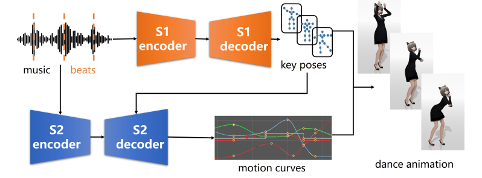

# DanceNet3D

This repository hold the codebase for our paper:

**[DanceNet3D: Music Based Dance Generation with Parametric Motion Transformer](https://arxiv.org/abs/2103.10206)**, Buyu Li, Yongchi Zhao, Lu Sheng.

    

## Dance Generation

Dancing performance generated by DanceNet3D and baselines on our *PhantomDance* dataset.

<table width=100%>
<tr>
  <td>
    <video src="https://huiye-tech.github.io/files/NiZuiZuiZuiZhongYao_Li.mp4" controls="controls" width=80%></video>
  </td>
  <td>
    <video src="https://huiye-tech.github.io/files/NiZuiZuiZuiZhongYao_Li.mp4" controls="controls" width=80%></video>
  </td>
</tr>
<tr>
  <td>
    <video src="https://huiye-tech.github.io/files/NiZuiZuiZuiZhongYao_Li.mp4" controls="controls" width=80%></video>
  </td>
  <td>
    <video src="https://huiye-tech.github.io/files/NiZuiZuiZuiZhongYao_Li.mp4" controls="controls" width=80%></video>
  </td>
</tr>
<tr>
  <td>
    <video src="https://huiye-tech.github.io/files/NiZuiZuiZuiZhongYao_Li.mp4" controls="controls" width=80%></video>
  </td>
  <td>
    <video src="https://huiye-tech.github.io/files/NiZuiZuiZuiZhongYao_Li.mp4" controls="controls" width=80%></video>
  </td>
</tr>
<tr>
  <td>
    <video src="https://huiye-tech.github.io/files/NiZuiZuiZuiZhongYao_Li.mp4" controls="controls" width=80%></video>
  </td>
  <td>
    <video src="https://huiye-tech.github.io/files/NiZuiZuiZuiZhongYao_Li.mp4" controls="controls" width=80%></video>
  </td>
</tr>
</table>

## *PhantomDance* Dataset

We will realease 100 of the dataset as the *PhantomDance-100* Dataset, which has 794776 frames(about 3.7 hours).

E-Mail: libuyu@huiye.tech

## Code

Code is coming soon.